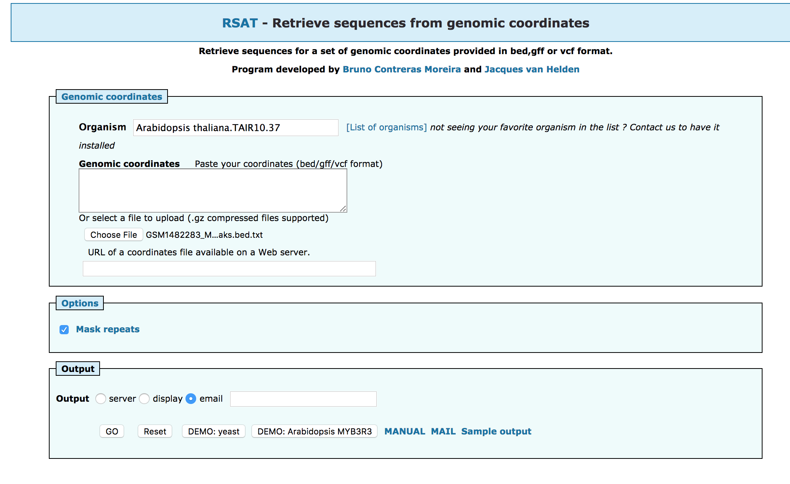
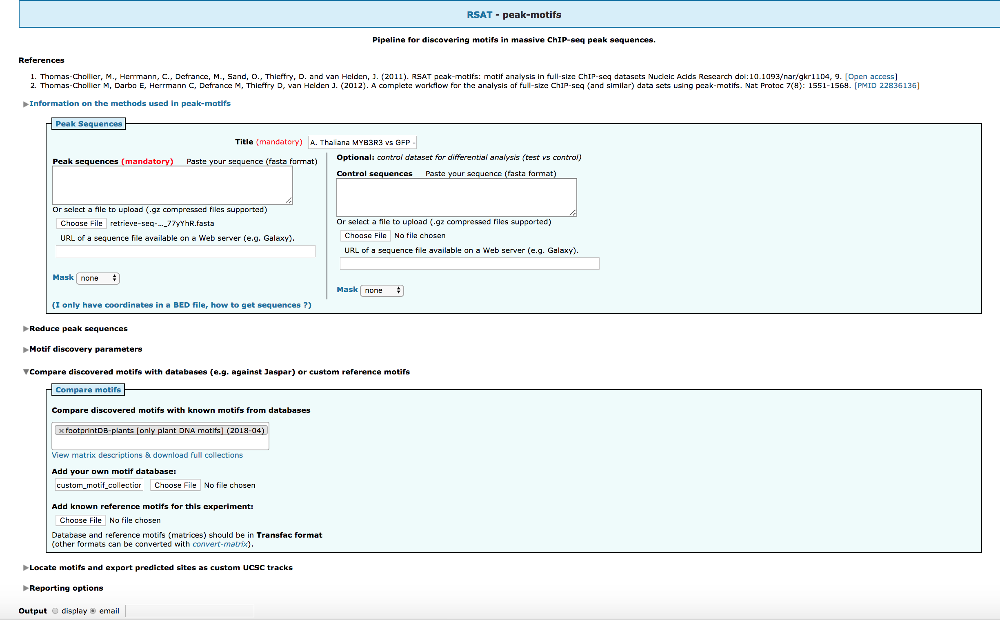
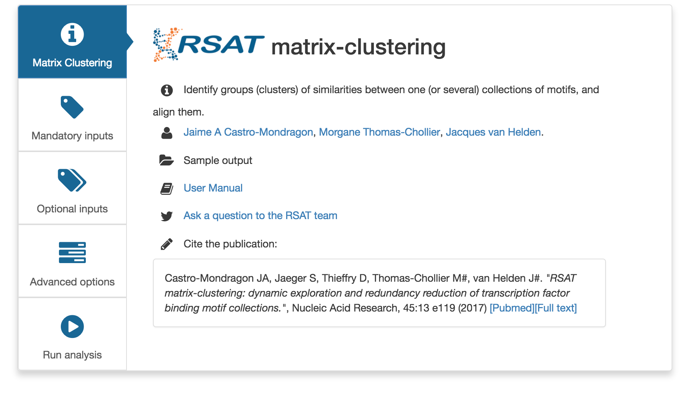
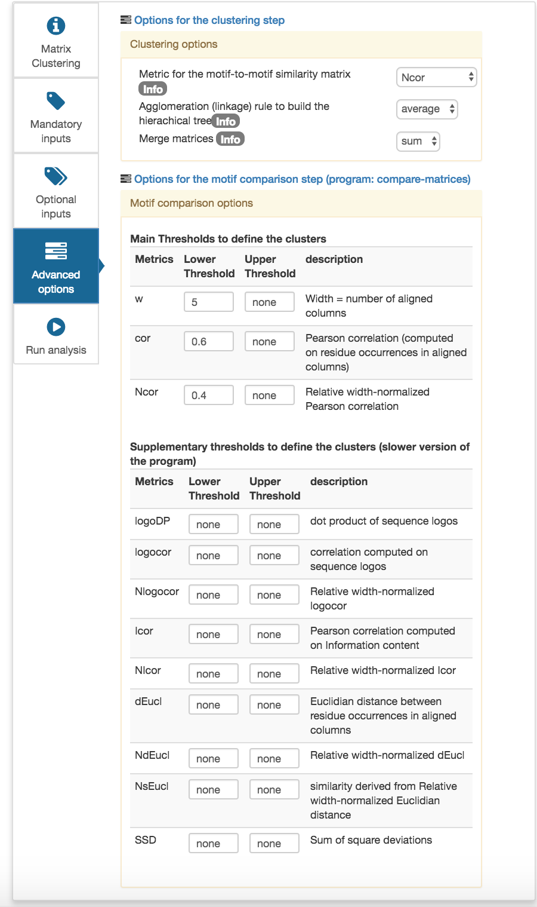
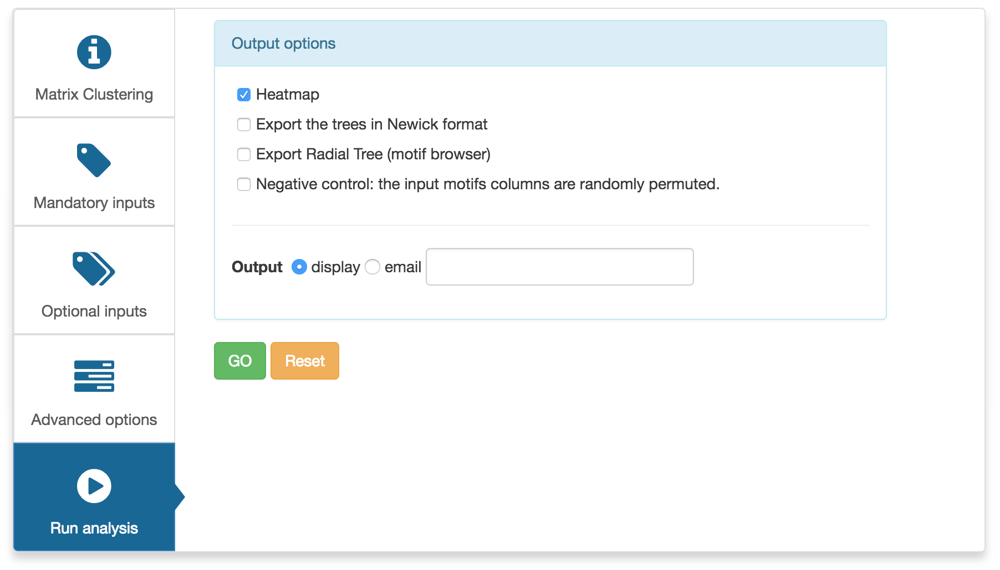

# RSAT 20 years workshop: training session"
## "Motif analysis in Plant ChIP-seq peaks"
Authors: "Alejandra Medina-Rivera, Morgane Thomas-Chollier and Jacques van Helden"
<!-- 
---
title: "RSAT 20 years workshop: training session"
subtitle: "Motif analysis in Plant ChIP-seq peaks"
author: "Alejandra Medina-Rivera, Morgane Thomas-Chollier and Jacques van Helden"
date: '`r Sys.Date()`'
output:
  html_document:
    self_contained: false
    fig_caption: yes
    highlight: zenburn
    theme: cerulean
    toc: yes
    toc_depth: 3
    toc_float: yes
  slidy_presentation:
    fig_caption: yes
    fig_height: 6
    fig_width: 7
    highlight: tango
    incremental: yes
    keep_md: yes
    smaller: yes
    theme: cerulean
    toc: yes
    widescreen: yes
  ioslides_presentation:
    colortheme: dolphin
    fig_caption: yes
    fig_height: 6
    fig_width: 7
    fonttheme: structurebold
    highlight: tango
    smaller: yes
    toc: yes
    widescreen: yes
  pdf_document:
    fig_caption: yes
    highlight: zenburn
    toc: yes
    toc_depth: 3
  beamer_presentation:
    colortheme: dolphin
    fig_caption: yes
    fig_height: 6
    fig_width: 7
    fonttheme: structurebold
    highlight: tango
    incremental: no
    keep_tex: no
    slide_level: 2
    theme: Montpellier
    toc: yes
font-import: http://fonts.googleapis.com/css?family=Risque
font-family: Garamond
transition: linear
bibliography: bibliography.bib
biblio-style: "apalike"
link-citations: yes
---

```{r include=FALSE, echo=FALSE, eval=TRUE}
library(knitr)
options(width=300)
knitr::opts_chunk$set(
  fig.width = 7, fig.height = 5, 
  fig.path='figures',
  fig.align = "center", 
  size = "tiny", 
  echo = TRUE, eval=TRUE, 
  warning = FALSE, message = FALSE, 
  results = TRUE, comment = "")
# knitr::asis_output("\\footnotesize")

```
--> 

## Introduction

In 2018, the Regulatory Sequence Analysis Tools (RSAT) software suite celebrates its $20^{th}$ birthday by organising a 1-day workshop in Paris (May 17-18, 2018). 

This page contains a 3-hours tutorial to get familiar with RSAT based on a study case where we analyse motifs in plant ChIP-seq peaks. This tutorial is derived from a previously published protocol [@pmid27557775]. The concepts seen here apply to other organisms as well. 


### High-troughput characterization of regulatory regions

The ChIP-seq technology permits to determine experimentally all the DNA binding locations of a transcription factor, as well as diverse histone modifications related to epigenetic regulatioN. 

ChIP-seq consists in the immunoprecipitation of a protein bound to the DNA (Histone with a specific modification or a transcription factor), followed by the sequencing of the immunoprecipitated DNA fragments. 

The pulled down sequences are then on aligned to the genome (*read-mapping*), and the regions in reads (*peaks*) are detected with a *peak-calling* software tool. In brief, peaks are considered as regions where the protein of interest is likelt to be bound, given the local enrichment of aligned reads in ChIP-ped samples compared to a given control (so-called "*input*").

![Figure1: From Castro-Mondragon, et al 2016, genome browser screen shot of a 9 kb region in chromosome 1 of the *Arabidopsis thaliana* genome. The top tracks show the read coverage profile from a ChIP-seq experiment for MYB3R3 transcription factor (brown) and its control (gray). The bottom panel shows peaks obtained using different bioinformatics tools (peak-callers) with variable parammeters (see [@pmidpmid27557775] for details).](figures/Figure1_mapped_reads.png "Figure1")

### Regulatory Sequence Analysis Tools

Since 1998, van Helden and collaborators developed a software suite combining specialised tools to analyse regulatory motifs in genomic sequences ([**RSAT**; http://www.rsat.eu/](http://www.rsat.eu/)). 

Although initial project started with the first fully sequenced eukaryote, the bdding yease *Saccharomyces cerevisiae*, it soon incorporated other organisms, attempting to cope with the ever-increasing number of sequenced genomes. 

In 2015, the Web access was distributed over 6 dedicated servers in order to enable a better management of genomic data, and to rationalise the presentation of some taxon-specific tools.  

For the current tutorial we will be using, preferentially, the [**RSAT::Plants** server (http://plants.rsat.eu/)](http://plants.rsat.eu/), where the *Arabidopsis thaliana* genome is installed (we will use assembly TAIR10.37).

## Materials

### Tools

1. *sequences from bedbed/gff/vcf*: Retrieves sequences from a genome given a set of coordinates 

2. *peak-motifs*: discover exceptional motifs from a set of peak sequences, based on a combination of motif discovery algorithms relying on different criteria (enrichment, positional bias, local enrichment). 

3.  *matrix-clustering*: identify similarities across a collection of motifs.

### Study case

*MYB3R3 ChIP-Seq peaks were downloaded from GEO NCBI [ftp site](ftp://ftp.ncbi.nlm.nih.gov/geo/samples/GSM1482nnn/GSM1482283/suppl/GSM1482283_MYB3R3-GFP_ChIP_peaks.bed.txt.gz)

## Tutorial

### Downloading peak coordinates

1. Create a temporary folder on your computer to store the data and results of this tutorial. 

2. Download the [peak coordinates](ftp://ftp.ncbi.nlm.nih.gov/geo/samples/GSM1482nnn/GSM1482283/suppl/GSM1482283_MYB3R3-GFP_ChIP_peaks.bed.txt.gz) in this folder. 

3. Open the (uncompressed) bed file with a spreadsheet like Excel or Office calc and check its content. Information about the bed format can be found on the [UCSC Genome Browser](https://genome.ucsc.edu/FAQ/FAQformat.html#format1).  


### Retrieving ChIP-seq peaks sequences from the TAIR10.37 genome

1. Open in a separate window a connection to the the [RSAT::Plants server](http://plants.rsat.eu/) server. 

2. In the left-sided menu, find the tool named *sequences from bed/gff/vcf* (you can either click on **view all tools**, or use the search box at the top of the tool pane.

2. Start typing the name of the organism of interest, in this case *Arabidopsis*. While you do this, the Web form will provide the possible completions for the organism name. Select *Arabidopsis thaliana.TAIR10.37*. 

3. To specify the **genomic coordinates** you can either **upload** a file from your computer (e.g. the file that you downloaded in the previous section), or directly paste the link (e.g. ftp site above) in the **URL** textbox. 

4. Optionally, you can select email output in order to be notified of the query submission and completion (you shoud thus receive 2 separate emails for aach query). 

5. After a few seconds, the server displays a link to the output file, which contains the fasta-formatted sequences of the peaks.  You can either download the fasta sequences to your computer, or save the URL, that will be used for following steps^[The second option is particularly interesting if you have a slow internet connection, since this avoids to download the sequences and upload them for further analysis].




### Discovering over-represented motifs in the set of peak sequences

1.In any [RSAT server](http://plants.rsat.eu/) server, find the tool *peak-motifs*.

2. Type an appropriate **tittle** for the analysis, for example: *A. Thaliana MYB3R3 vs GFP - GSM1482283*.

3. For the **Peak sequences** option set, paste the URL of the fasta sequence file obtained in the previous section (alternatively, you can upload the fasta file from your local copy but this will take more time-. 

4. Explore the other options! We will discuss them during the training session. 

5. Specify a transcription factor database that will be used to associate the discovered motifs putative bound factors. For this dataset we will select **footprintDB-plants**. Note that the tool also allows you to upload a custom motif collection in Transfac format.

6.Under **Locate motifs and export predicted sites as custom UCSC tracks**, in **Visualiza peaks ans sites in genome browser**, select peak coordiantes specified in fasta headers in *bedtools getfasta* format, asumming we used the *sequences from bed/gff/vcf* to retrieve the sequences.



7.A link to the results will appear. Anticipated results can be found [here](./peak-motifs.2018-05-11.190016_2018-05-11.190016_zkwbfV/peak-motifs_synthesis.html).

8. *peak-motifs* results include:

  1. **Results summary**: The set of discovered motifs and the full results can be downloaded.

  2. **Sequence composition**: Shows the nucleotidic composition of the peaks.
    Is possible to observed the size distribution of the peaks (mean of 200bps). Two transition tables are show, one for mono-nculeotide compistion and a second one for di-nucleotide compostion. 
    
  3. **Discovered motifs by algorithm**:  The discovered motifs are organized by algorithm, and the motif name is built with the options used to retreive the motifs (k-mer length, markov model, rank of the motif). The motif logo is shown in both orientation and a motif comparison with the selected database is shown.
  
9. Note that the algorithms display similar motifs, hence the next step would be to reduce motif redundancy. 

### Clustering motifs

RSAT provides the tool *matrix-clustering* to reduce redundancy in a motif collection. This splecially usefull when several motif-discovery algorithms have been used on a data set, and several highly similar motifs have been found, like is the case in the current protocol.

1. Open the tool *matrix-clustering* in the [RSAT:Plant](http://plants.rsat.eu) server.


2. On the title box give a title to the analysis.

3. Input the motif file containing the resuleting motifs from *peak-motifs*.


4. Options can be tuned to trim the tree comparing the motifs with different thresholds. For the current protocol we recomened using **w**=5 and **Ncor**=0.55.

5. In advanced options, select *Ncor* (Normalized Pearson Correlation) and *average*


6. Select one output option. Since the program could take some time depending on the size of the collection we recomend using **email**.



7. A results summary show a table with the number of input motifs together with the used parameters and a link to download the results.

8. The **Logo forest** shows a tree conecting the motifs by similarity. There are tow visualization formats, a dynamic browsable one and a low aulaity image allows for a quick overview.

9. The **Individual motifs view** shows a table with the input motifs a general information on the,

10. The **Individual cluster view** shows general information regarding each cluster.

11. The **Heatmap view** sumairzed the result of motif similarities in a heatmap of the clusters.

12. To obtain the reduced motif set click on the link under dowload root motifs in the summary section.


## References

1. Castro-Mondragon, J.A. et al. (2016). Methods Mol Biol., 1482, 297–322
